<div align="center">



**Building AI gateways, automation tooling, and Deutschup — a German-learning app.**

`Python` · `TypeScript` · `React` · `Go`

[](https://github.com/Shinzzyak)
&nbsp;
[](https://github.com/Shinzzyak)

</div>

---

## 🧭 What I'm building

- **AI gateways** — [VansRouter](https://github.com/Shinzzyak/VansRouter): free AI coding router (Claude Code, Codex, Cursor, Cline, Copilot → 40+ providers, auto-fallback) · [AMRouter](https://github.com/Shinzzyak/AMRouter): self-hosted OpenAI-compatible gateway with Cloudflare Workers automation
- **Automation tooling** — [proxy-scraper](https://github.com/Shinzzyak/proxy-scraper) · [promptvault-audit](https://github.com/Shinzzyak/promptvault-audit) · [SignalLink](https://github.com/Shinzzyak/SignalLink) · [Auto-Clip](https://github.com/Shinzzyak/Auto-Clip) · [daily-notifier-bot](https://github.com/Shinzzyak/daily-notifier-bot) · [mekithil](https://github.com/Shinzzyak/mekithil)
- **Deutschup** — German-learning app (React 19 · Vite · TypeScript · Clerk · Supabase · Gemini AI)

---

## 🛠️ Tech stack

<p>
  
  
  
  
  
  
  
  
  
  
  
  
  
</p>

---

## 📈 Stats

<div align="center">
  
  
</div>

---

## 🐍 Contribution graph

<div align="center">
  
</div>

---

## 📚 Learning notes

Curated roadmaps, course lists, and tech analyses → **[dev-learning-notes](https://github.com/Shinzzyak/dev-learning-notes)**

---

## 💡 Principles

```
→ Write code others can read
→ Document everything
→ Open source by default
→ Ship it, then improve it
```

---

<div align="center">

*Open an issue, fork a repo, or just say hi.*

[](https://github.com/Shinzzyak)

</div>